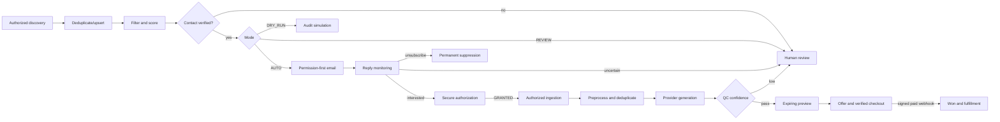
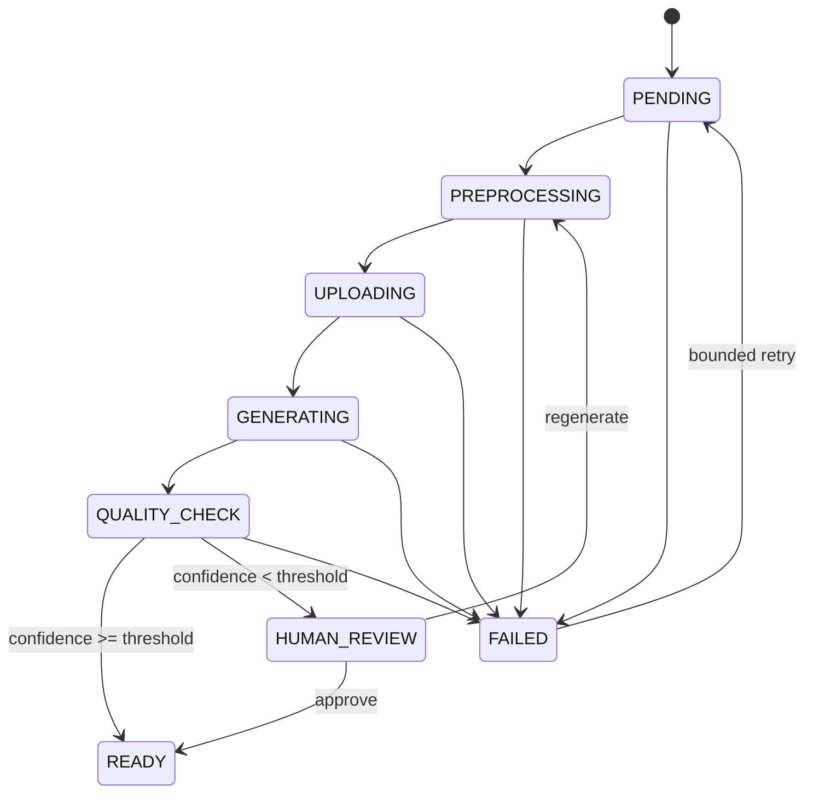

# Listing Revival AI

A compliance-first, production-oriented MVP for finding stale residential listings, qualifying the **listing agent**, requesting media permission, producing an AI-style walkthrough through a replaceable provider, and converting approved previews into paid packages.

> **Safe by default:** `AUTOMATION_MODE=DRY_RUN`. No email, paid generation, or payment action is performed until operators deliberately configure and validate providers. This repository does not scrape sites, bypass controls, guess contact details, or process listing photographs without recorded authorization.

## Architecture proposal

The application is a modular Next.js TypeScript control plane backed by PostgreSQL/Prisma. Domain modules own decisions and are independent from transport. Provider contracts isolate listing acquisition, email, virtual tours, payments, jobs, and future AI services. BullMQ/Redis is the intended durable production dispatcher; the included in-memory dispatcher makes local and cron flows safe to inspect. The UI is an operator console, not a public multi-tenant surface.

```text
Authorized MLS/API ─┐
CSV / manual URL ───┼─> ListingSource ─> qualification ─> PostgreSQL CRM
Licensed feed ──────┘                         │                 │
                                             v                 v
Scheduler ─> queue contracts ─> outreach policy ─> EmailProvider/inbound events
                                permission gate ─> asset validation ─> TourProvider
                                QC gate ─> expiring preview ─> PaymentProvider ─> delivery
```

### Directory structure

```text
app/                 Next.js dashboard, lead/review/settings/preview pages, API routes
components/          shared operator navigation
lib/ai/              conservative reply classification boundary
lib/config/          validated environment configuration
lib/domain/          scoring, consent, transitions, workflows, deduplication
lib/email/            provider contract, compliance/rate-limit/follow-up rules
lib/listings/         authorized ListingSource contract and CSV/mock adapters
lib/payments/         payment contract and signature primitives
lib/queue/            scheduler-neutral queue contract
lib/tours/            replaceable VirtualTourProvider and mock
prisma/               PostgreSQL schema and fictional Ohio seed
scripts/              operational scripts (reserved)
tests/                safety and workflow unit tests
.github/workflows/    optional external cron trigger
```

## Workflow and state machines





Lead lifecycle: `DISCOVERED → QUALIFIED → OUTREACH_READY → CONTACTED → REPLIED → INTERESTED → PERMISSION_GRANTED → ASSETS_RECEIVED → GENERATING → PREVIEW_READY → OFFER_SENT → WON`. `LOST` and `DO_NOT_CONTACT` are terminal business outcomes. Listing changes to pending/sold, a bounce, reply, unsubscribe, permission, or manual stop cancel follow-ups.

## Implemented MVP

- Complete relational schema for listings, sources/provenance, agents, brokerages, leads, campaigns, mail/events, replies, consent evidence, images, tours/jobs, follow-ups, suppression, audit, and settings.
- Tiered, normalized 0–100 scoring with eligibility filters and readable reasons.
- Contact-confidence gate, permanent suppression, daily/per-domain caps, mode gates, compliant footer helper, and bounded default cadence.
- Cryptographically random authorization tokens stored as hashes; generation rejects every state except `GRANTED`.
- Mock/CSV listing source and mock email/tour/payment providers; no undocumented third-party calls.
- Conservative reply parser with immediate unsubscribe recognition and configurable human-review threshold.
- Explicit generation/listing transitions, QC decision, scheduler-neutral daily pipeline, signed cron endpoint, and fictional demo dashboard.
- Expiring-preview data model and disclosure UI. Production must enforce expiry in the persistence-backed page loader.

## Local setup

Requirements: Node.js 20+, PostgreSQL 15+, and Redis 7+ for a durable production worker.

```bash
cp .env.example .env
npm install
npm run db:generate
npm run db:migrate -- --name init
npm run db:seed
npm run dev
```

Open `http://localhost:3000`. All seed names/addresses are fictional and all emails use the reserved `.invalid` domain.

## Configuration and credentials needed

Provide these through a secrets manager—not source control:

1. **Authorized listing data:** chosen vendor name, contract/terms confirmation, official API documentation, sandbox and production credentials, permitted fields/media rights, rate limits, and webhook/feed details. CSV/manual imports work without a vendor credential.
2. **Database and queue:** production PostgreSQL `DATABASE_URL`, Redis `REDIS_URL`, TLS requirements, backup/restore policy, and data region.
3. **Business identity:** legal/trading name, valid physical mailing address (`BUSINESS_ADDRESS`), support contact, privacy-policy and terms URLs, sending name/address, target regions, and legal approval for consent copy/retention.
4. **Email:** selected provider, verified domain/from address, API credential, official inbound/delivery webhook docs and signing secret, unsubscribe domain, and DNS records (SPF, DKIM, DMARC). Resend/SendGrid variables are placeholders; neither adapter is represented as complete.
5. **OpenAI:** API key, approved configurable model, project limits, and data-handling policy. The MVP fallback classifier is deterministic and does not call OpenAI.
6. **Virtual tour:** selected vendor, official API documentation, sandbox key, media constraints, commercial license, pricing/limits, callback signing details, and confirmation that photo-derived generation is allowed. Only the mock is implemented.
7. **Stripe:** secret key, webhook signing secret, configured product/price ID, business/tax settings, success/cancel origins, and webhook endpoint. The MVP endpoint is audit-only and explicitly not a Stripe SDK adapter.
8. **Hosting/storage:** production URL, `CRON_SECRET`, scheduler choice, private object-storage credentials/CORS/retention, malware scanner, auth/SSO provider, observability, alert destinations, and encryption/secrets controls.

Every supported variable and safe default is documented in `.env.example`.

## Providers and integrations

| Capability | Included | Production status |
|---|---|---|
| Listing source | `ListingSourceAdapter`, CSV and mock | Connect only documented/licensed feed |
| Email | `EmailProvider`, mock | No real sends; implement official SDK/webhooks |
| AI | deterministic classifier boundary | OpenAI adapter pending credentials/policy |
| Tour | `VirtualTourProvider`, mock | No paid calls; vendor selection pending |
| Payment | `PaymentProvider`, mock + generic test HMAC | Audit-only; official Stripe SDK required |
| Queue | `JobDispatcher`, in-memory | Use BullMQ/Redis worker in deployment |
| Scheduler | signed HTTP route + GitHub Actions example | Scheduler-neutral |

Never enable an adapter merely because an environment variable exists. Complete sandbox tests, webhook replay/idempotency tests, and an operator runbook first.

## Scheduler

`POST /api/cron/daily` requires `Authorization: Bearer $CRON_SECRET` and queues idempotent daily stages. `.github/workflows/daily.yml` demonstrates an external trigger. The cron comment calls out DST; use a scheduler with `America/New_York` timezone support for exact local schedules. In production split the plan into 06:00 refresh, 06:30 discovery, 07:00 scoring, 08:30 queue preparation, gradual 09:00–16:00 sends, hourly replies/status checks, and an evening report. Random spacing may protect rate limits but must never evade spam controls.

## Database and migrations

Prisma targets PostgreSQL. Run `npm run db:migrate -- --name init` against a development database and commit its generated migration before first deployment. CI can use `prisma migrate deploy`. The composite `(sourceId, externalId)` constraint prevents listing duplicates; image checksums and provider event IDs provide additional idempotency.

## Email, consent, and compliance

Only `VERIFIED`, `PUBLIC_BUSINESS_CONTACT`, or explicit manually approved contacts qualify. First contact asks for interest and permission. It must contain honest factual copy, business identity/address, and a one-click unsubscribe. Suppression entries are permanent by default and checked before every send. A reply stops all follow-ups. Permission evidence includes version, token hash, principal, listing, timestamps, optional legally approved IP/user agent, and evidence metadata.

Before launch, counsel must approve CAN-SPAM/privacy/consent language, record retention, target-market rules, and image rights. Opens can be privacy-invasive and should only be measured when provider support and policy permit. This software is a control framework, not legal advice.

## Payment and fulfillment

Do not trust redirect/query state. A documented provider adapter must verify the raw webhook with the official SDK, enforce event idempotency, verify amount/currency/lead metadata, update payment and lead in one transaction, audit it, and only then queue delivery. Base price defaults to **$249.00** (`24900` cents). Subscriptions are future offers and never automatic enrollments.

## Testing and quality gates

```bash
npm test
npm run lint
npm run typecheck
npm run build
```

Tests cover scoring, deduplication, suppression, reply stops, permission gating, rate limits, reply parsing, signature verification, listing transitions, and the generation state machine. Before production add PostgreSQL integration tests, queue retry/dead-letter tests, authenticated route tests, provider contract tests, webhook fixtures, upload fuzzing/virus scans, accessibility tests, and end-to-end consent-to-payment tests.

## Moving DRY_RUN → REVIEW → AUTO

1. Stay in `DRY_RUN` while connecting sources, generating audit logs, verifying targets, and validating suppression/rate limits.
2. Add admin authentication/RBAC, persistent queue workers, object storage, observability, privacy controls, and tested official provider adapters.
3. Move to `REVIEW`; approve every first email, generation, and sales email. Reconcile every webhook and daily report.
4. Obtain legal/security approval, establish bounce/complaint thresholds and incident switches, then canary a tiny verified cohort.
5. Move to `AUTO` only after the checklist succeeds. Keep `PAUSE_ALL_OUTREACH`, `PAUSE_GENERATION`, and `PAUSE_DISCOVERY` immediately available.

## Implementation phases

1. **Foundation (included):** architecture, schema, config, deterministic domain controls, mocks, dashboard, scheduler contract, tests.
2. **Persistence:** migration, repositories/transactions, BullMQ workers, idempotency, auth/RBAC, audit viewer, settings persistence.
3. **Compliant outreach:** selected official email adapter, signed inbound events, templates/experiments, approval UI, suppression administration.
4. **Authorized media:** consent page, private uploads/storage, file validation, perceptual hashing and optional room classification.
5. **Tour/commerce:** documented tour sandbox adapter, automated QC signals, expiring signed previews, official Stripe adapter, fulfillment ZIP/QR/video assets.
6. **Scale/insight:** daily reports, cohort analytics, cost/margin dashboards, multi-region sources, brokerage relationships, subscriptions, white-label portals, predictive scoring with human oversight.

See [`TODO.md`](TODO.md) for the deployment checklist and Phase 2 backlog.

## Run the top-five workflow right now

The repository now includes a dependency-free operational dry run, so it works even before Next.js packages, PostgreSQL, or Redis are available:

```bash
npm run test:zero-deps
npm run demo:top5
# Custom authorized export:
node scripts/run-top5.mjs /secure/path/authorized-listings.json reports/top-5-dry-run.json
```

The input must match `data/authorized-listings.example.json`. Set `sourceAuthorized: true` only when the record came from your licensed feed, an authorized export, or manual data you are entitled to use. Agent emails must be verified or published business contacts; the workflow does not guess or harvest addresses. The command applies target/qualification filters, ranks candidates, selects one variant per lead, and writes five personalized **permission-request drafts**.

It deliberately does **not** send mail or generate tours. The example contacts use `.invalid`, and the listing records are fictional. To operate on real leads, supply an authorized listing export containing verified/public-business listing-agent contacts plus your real `EMAIL_FROM_NAME`, `EMAIL_FROM_ADDRESS`, `BUSINESS_ADDRESS`, public `APP_URL`, and a tested email-provider adapter. Only after an agent grants the recorded image-use permission may the generation workflow process their media. This ordering is a legal and product safety requirement, not a missing automation step.

## Generated example 3D model

Run `npm run generate:example-model`, then open `/demo-model` in the app or import `public/models/example-house.obj` together with `public/models/example-house.mtl` into an OBJ-compatible 3D tool. This is a real, procedurally generated mesh with named house, roof, door, window, garage, foundation, and porch groups. It is intentionally synthetic and uses no listing photographs; its metadata and preview clearly state that it is not a real property or architecturally accurate.

The production permission gate remains unchanged for real listing media. A public URL proves that a browser can retrieve a photograph; it does not encode the media license or establish who owns the commercial derivative rights. Authorized/licensed real listing photos can use the same provider pipeline after provenance and permission are recorded.
